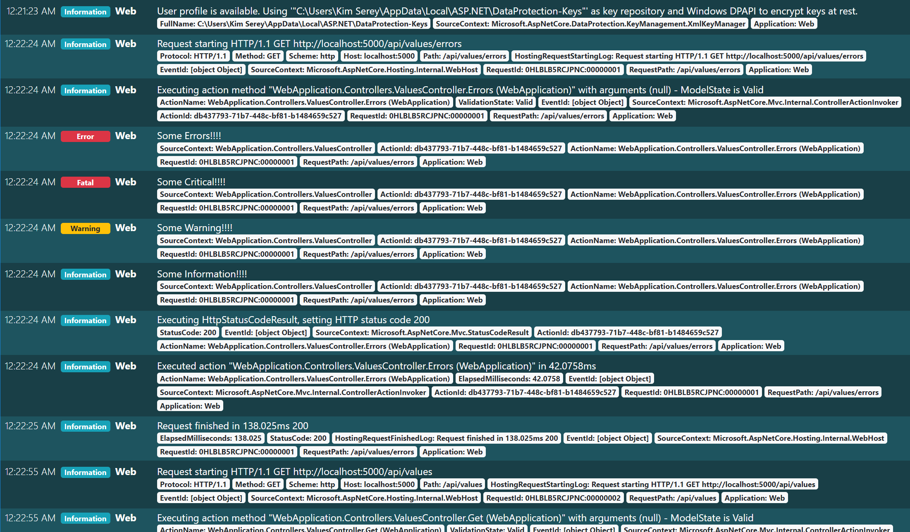

# Implementation of a Log Server

This is a sample of a simple implementation of a Log Server using Serilog.
Serilog is a logging framework providing structured logs and allowing writing to systems called `sinks`.

The implementation contains a Log Server which receives logs from the Web application and serves a log page where logs are pushed via server-sent events.

The Web application write logs using the following `sinks`:
 
 - Console
 - RollingFile
 - Http

The console sink writes to the console. The rolling file sink writes logs into daily rolling files. The Http sink writes into the Log Server HTTP POST endpoint.

The Log Server serves following live log page:

